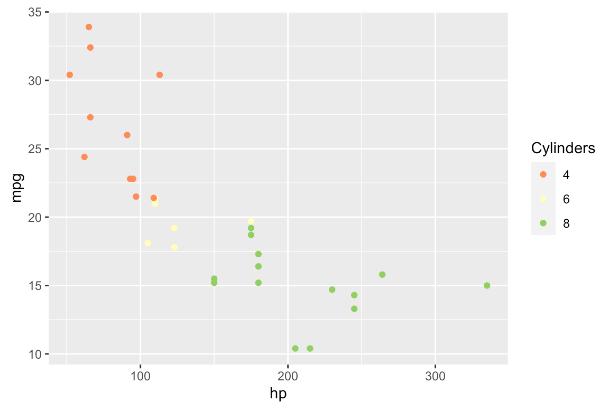
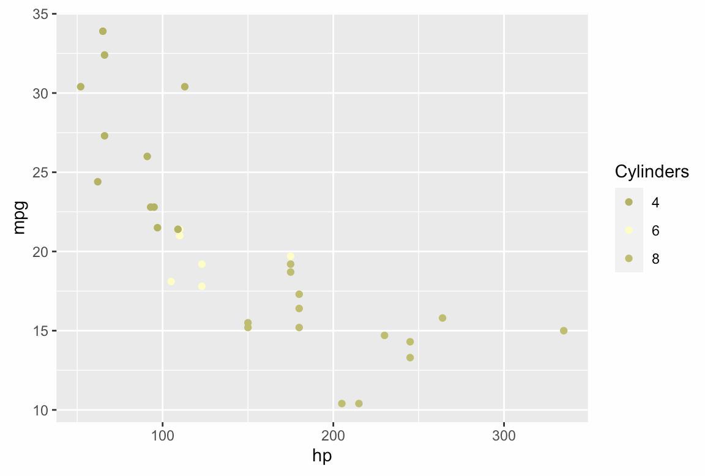

```{r setup, include=FALSE}
knitr::opts_chunk$set(echo = TRUE)
```

These notes are geared toward preserving and increasing the accessibility of R Markdown/Quarto documents, especially HTML output files.

---

#### Contents
- [Alt text for images](#alt-text-for-images)  
- [Color considerations](#color-considerations)  
- [Presenting math formulas](#presenting-math-formulas)  
- [Hyperlinks](#hyperlinks)  
- [Remove hash signs in R code output](#remove-hash-signs-in-r-code-output)  

---

#### Alt text for images

- Succinct description
- Don't start alt text with "image of...," "graphic of...," etc.
- Alt text should be "equivalent," meaning that it communicates the content and function of a graphic
  - It doesn't need to communicate every descriptive detail
  - For an image of a set of mugs next to each other, consider "five mugs side-by-side on a counter," not "a green mug with a purple logo and a small handle sitting next to a white mug with its handle facing forward sitting next to..."
- For complex images, provide a succinct description, and consider placing a longer description nearby or in a linked appendix

In R Markdown/Quarto, alt text can be added before the image path:

`{width='50%'}`

By default, the alt text will be added as a caption under the image. It can be suppressed and left as invisible alt text by modifying the YAML header like so:

```
output:
  html_document:
    fig_caption: false
```

Alternatively, add alt text directly to HTML. For example:

``

#### Color considerations

Color blindness can disrupt the interpretation of plots. For example, the following plot:

{width='50%'}

Would appear (approximately) to a person with deuteranopia (red-green color blindness) as:

{width='50%'}

Discriminating between the four-cylinder and eight-cylinder observations is nearly impossible.

The `RColorBrewer` R package provides a set of colorblind-friendly palettes for plotting:

```{r, eval = F}
RColorBrewer::display.brewer.all(colorblindFriendly = T)
```

The free, open-source [Color Oracle application](https://colororacle.org/index.html) provides a set of full-screen filters that can be toggled on and off to evaluate how a plot or graphic would look with each of several varieties of color blindness.

#### Presenting math formulas

Using LaTeX to present math formulas ensures that they can still be parsed by a screen reader. A screen reader can't necessarily read a formula shown in an embedded image.

`$$y = mx + b$$` renders as:

$$y = mx + b$$

#### Hyperlinks

Hyperlinks should balance concision and descriptiveness. (All of the following examples use [google.com](google.com) as a filler link.)

- [Click here](google.com) is ambiguous and minimally helpful
- [Tips for writing accessible content](google.com) is preferable
- If a hyperlink downloads a file, communicate that: [Coffee brewing guide (PDF, 3 MB)](google.com)

#### Remove hash signs in R code output

Add `comment = ''` to chunk headers, or place it in the header chunk (`opts_chunk$set(comment = '')`).

Example output with `comment = ''` in the header:

```{r, comment = ''}
1 + 1
```

Example output without `comment = ''` added to the header:

```{r}
1 + 1
```

Removing hash signs from R chunk output removes bloat and keeps a screen-reader from reading out "number, number" before reading out each line of results.

---

These notes are partially based on:

- [Slides from a 2022 WebAIM presentation to UVA employees](https://webaim.org/presentations/2022/uva-docs/)
- [NCSU notes on accessible hyperlinks](https://accessibility.oit.ncsu.edu/accessible-hyperlinks/)
- ["Accessible R Markdown Documents" by Jonathan Godfrey](https://r-resources.massey.ac.nz/rmarkdown/)